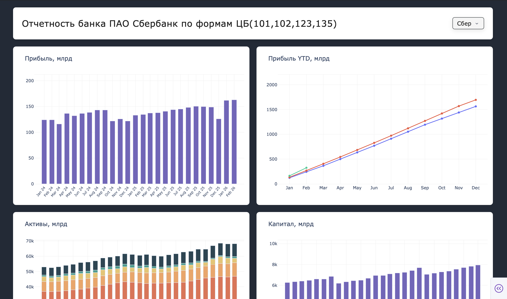
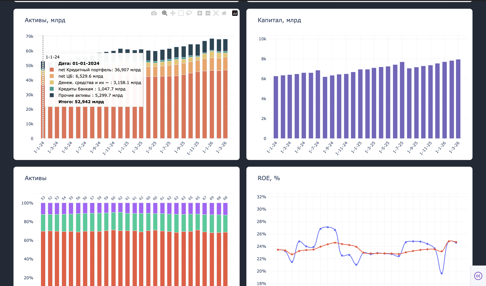
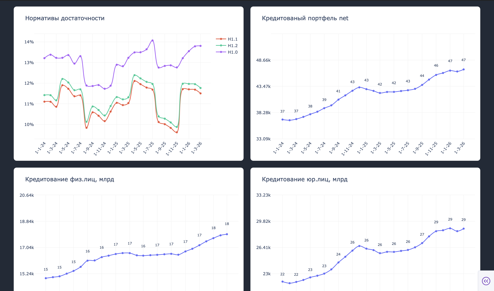

# Central Bank Financial Dashboard

Interactive financial analytics dashboard built with Python, Dash and Plotly.
The project collects financial data from the Central Bank, processes it, and visualizes key banking indicators.

## Key features

- Data collection from Central Bank source
- Data cleaning and preprocessing

- Financial metrics calculation:
  - Profit (monthly and YTD)
  - ROE (Return on Equity)
  - Capital dynamics
  - Capital adequacy ratios

- Asset structure analysis (interactive breakdown)

- Credit portfolio analysis (retail vs corporate)

- Deposit portfolio analysis (retail vs corporate)

- Interactive dashboards with Plotly

## Visualizations

- Profit dynamics (monthly & YTD)
- Asset structure analysis (including 100% breakdown)
- Capital dynamics
- ROE analysis
- Credit portfolio distribution (retail vs corporate)
- Deposit structure (retail vs corporate)


  cb-financial-dashboard/
├── main.py
├── src/
│   ├── parser_cb.py
│   ├── preprocessing.py
│   ├── metrics.py
│   ├── graphs/
│       ├── profit.py
│       ├── roe.py
│       ├── assets.py
│       ├── deposits.py
├── assets/
├── requirements.txt

## Run project

```bash
pip install -r requirements.txt
python main.py
```
## Dashboard preview



qwerty
